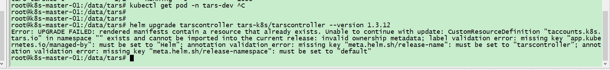

# 目录

- [升级](#升级)
  
    * [兼容性](#兼容性)
    * [获取 Helm Chart](#获取HelmChart)
    * [升级 Controller](#升级Controller)
        + [检查 Framework 兼容性](#检查Framework兼容性)
        + [检查 Controller 兼容性](#检查Controller兼容性)
        + [执行 Controller 升级](#执行Controller升级)
        + [升级 Controller 常见问题](#升级Controller常见问题)
    + [升级 Framework](#升级Framework)
        + [确认 Controller 兼容性](检查Controller兼容性)
        + [生成 Framework 配置文件](#生成Framework配置文件)
        + [执行 Framework 升级](#执行Framework升级)
        + [等待 Framework 启动](#等待Framework启动)

# 升级

## 兼容性

**TarsCloud K8SFrameWork** 每次发布都会有相同版本号的 Controller 和 Framework 两个 Helm Chart  
版本号格式为: "主版本号.次版本号.修订号-附注说明". 

为了指导 "Controller","Framework"  安装、升级,我们制定了如下基于版本号的兼容性规则:

1. 兼容性规则只与 "主版本号码","次版本号" 相关
2. 当 "次版本" == 0 时, 提供前一主版本的最新两个次版本的兼容性保证
3. 当 "次版本" == 1 时, 提供前一主版本的最新一个次版本,同主版本的最新一个次版本的兼容性保证
4. 当 "次版本" >= 2 时, 提供同主版本的最新两个次版本的兼容性保证.

你在执行各项升降级操作前，请先执行如下兼容性检查,  
**不兼容的升级可能造成您的业务服务中断,或者业务数据丢失**

1. 升级 Controller 时, 请检查待升级的 Controller 版本是否兼容已安装的 Controller 版本
2. 升级 Controller 时, 请检查待升级的 Controller 版本是否兼容已安装的 Framework 版本
3. 升级 Framework 时, 请检查已安装的 Controller 版本是否兼容待升级的 Framework 版本
4. 降级 Framework 时, 请检查已安装的 Controller 版本是否兼容待降级的 Framework 版本
5. 降级 Controller 可能导致不可预知的问题, 我们不建议您对 Controller 执行降级操作

## 获取HelmChart

您可以选择如下一种方式:

+ 直接下载
  > 您可以在 [github](https://github.com/TarsCloud/K8SFramework/tree/master/charts) 查看和下载 Helm Chart，包名分别为 tarscontroller-${vesion}.tgz，tarsframework-${version}.tgz
  >
  
+ Helm Repo

  > 您可以 添加 tars-k8s repo, 然后在需要时通过 helm 指令获取
  >
  > ```shell
  > helm repo add tars-k8s https://tarscloud.github.io/K8SFramework/charts # 添加 tars-k8s repo
  > helm repo update tars-k8s                                              # 更新 tars-k8s repo 索引
  > helm search repo tars-k8s -l                                           # 查看 tars-k8s repo 索引
  > ```

+ 源码构建

  > 您可以参考 <<[构建](make.md)>>文档, 从源码构建 Helm Chart

## 升级Controller

### 检查Framework兼容性

您可以执行如下指令查看当前安装了哪些 Framework 版本

```shell
helm list -f tarsframework -A
```

您可以看到如下输出:

```shell
NAME           NAMESPACE REVISION  UPDATED                       STATUS   CHART                APP VERSION
tarsframework  tars    1           2022-06-01 11:09:09.034451845 deployed tarsframework-1.3.2  v1beta3  
```

CHAT 参数即代表了您已安装的 Framework 版本

### 检查Controller兼容性

您可以执行如下指令查看当前安装了哪些 Controller 版本

```shell
helm list -f tarscontroller -A
```
您可以看到如下输出:
```shell
NAME           NAMESPACE REVISION  UPDATED                       STATUS   CHART                APP VERSION
tarscontroller  default    1       2022-06-01 11:09:09.034451845 deployed tarscontroller-1.3.2  v1beta3  
```
CHAT 参数即代表了您已安装的 Controller 版本

### 执行Controller升级

如果您是通过  "直接下载" 或者 "源码构建" 方式获取的 Helm Chart, 执行如下指令:

```shell
# 您需要将 ${version} 替换成实际 版本号
helm upgrade tarscontroller tarscontroller-${version}.tgz
```

如果您是通过 Helm Repo 方式获取 Helm Chart, 执行如下指令:

```shell
# 您需要将 ${version} 替换成实际 版本号
helm repo update tars-k8s                                              # 更新 tars-k8s repo 索引
helm search repo tars-k8s -l                                           # 查看 tars-k8s repo 索引
helm upgrade tarscontroller tars-k8s/tarscontroller --version=${version}
```

操作后,您可以使用如下命令查看 Controller 启动详情, 如果操作报错，请参考 <<升级Controller常见问题>> 

```shell
kubectl get pods -n tars-system -o wide
```

### 升级Controller常见问题

我们列举了在升级 Controller 过程中常见故障,您可以参照处理

+ "cannot convert int64 to float64" 错误

  > 此错误为低版本(<=1.19.15) Kubernetes [bug](https://github.com/kubernetes/kubernetes/issues/87675) 导致,
  > 此错误也意味着您无法再次使用 helm 执行 upgrade controller 操作，建议您尽快升级集群版本(>=1.19.16), 你也可以参照如下说明执行升级:
  >
  > ```shell
  > # "直接下载" 或者 "源码构建" 方式获取的 Helm Chart: 
  > helm install tarscontroller charts/tarscontroller-${version}.tgz --dry-run | kubectl apply --validate=false -f -
  > 
  > # helm Repo 方式获取 Helm Chart, 执行如下指令:
  > helm install tarscontroller tars-k8s/tarscontroller --version=${version} --dry-run | kubectl apply --validate=false -f -
  > ```
  > 如果得到如下输出,表示升级成功 (忽略最后一行 error)
  >
  > ```shell
  > namespace/tars-system unchanged
  > serviceaccount/tars-agent unchanged
  > serviceaccount/tars-controller unchanged
  > configmap/tars-agent unchanged
  > storageclass.storage.k8s.io/tars-storage-class unchanged
  > customresourcedefinition.apiextensions.k8s.io/taccounts.k8s.tars.io unchanged
  > customresourcedefinition.apiextensions.k8s.io/tconfigs.k8s.tars.io unchanged
  > customresourcedefinition.apiextensions.k8s.io/tendpoints.k8s.tars.io unchanged
  > customresourcedefinition.apiextensions.k8s.io/texitedrecords.k8s.tars.io unchanged
  > customresourcedefinition.apiextensions.k8s.io/tframeworkconfigs.k8s.tars.io unchanged
  > customresourcedefinition.apiextensions.k8s.io/tframeworkkey.k8s.tars.io unchanged
  > customresourcedefinition.apiextensions.k8s.io/timages.k8s.tars.io unchanged
  > customresourcedefinition.apiextensions.k8s.io/tplugins.k8s.tars.io unchanged
  > customresourcedefinition.apiextensions.k8s.io/tservers.k8s.tars.io configured
  > customresourcedefinition.apiextensions.k8s.io/ttemplates.k8s.tars.io unchanged
  > customresourcedefinition.apiextensions.k8s.io/ttrees.k8s.tars.io unchanged
  > clusterrole.rbac.authorization.k8s.io/tars-system:tars-agent unchanged
  > clusterrole.rbac.authorization.k8s.io/tars-system:tars-controller unchanged
  > clusterrolebinding.rbac.authorization.k8s.io/tars-system:tars-agent unchanged
  > clusterrolebinding.rbac.authorization.k8s.io/tars-system:tars-controller unchanged
  > role.rbac.authorization.k8s.io/tars-controller unchanged
  > rolebinding.rbac.authorization.k8s.io/tars-controller unchanged
  > service/tars-webhook-service unchanged
  > daemonset.apps/tars-agent configured
  > deployment.apps/tars-controller-manger unchanged
  > mutatingwebhookconfiguration.admissionregistration.k8s.io/tars-mutating-webhook configured
  > validatingwebhookconfiguration.admissionregistration.k8s.io/tars-validating-webhook unchanged
  > error: unable to decode "STDIN": Object 'Kind' is missing in '{"HOOKS":null,"LAST DEPLOYED":"Mon Oct 31 17:01:58 2022","MANIFEST":null,"NAME":"tarscontroller","NAMESPACE":"default","REVISION":1,"STATUS":"pending-install","TEST SUITE":"None"}'
  > ```

+ "missing key" 和 "missing name" 错误:

  

  > 这是因为您之前手动安装过(kubectl apply ) CRD 资源对象，但这些 CRD 资源没有包含 Helm Chart 管理相关的标签和注解. 您可以执行如下指令，然后重试
  >
  > ```shell
  > #!/usr/bin/env bash
  > 
  > ControllerName="tarscontroller"
  > ControllerNameSpace="default"
  > 
  > WithoutHelmTarsCrd=$(kubectl get crd -l '!app.kubernetes.io/managed-by' 2>/dev/null | grep 'k8s.tars.io' | awk '{print $1}')
  > 
  > for CRD in "${WithoutHelmTarsCrd[@]}"; do
  >   kubectl label crd ${CRD} 'app.kubernetes.io/managed-by=Helm' --overwrite
  >   kubectl annotate crd ${CRD} "meta.helm.sh/release-namespace=${ControllerNameSpace}" "meta.helm.sh/release-name=${ControllerName}" --overwrite
  > done
  > ```

## 升级Framework

### 检查Controller兼容性

您可以执行如下指令查看当前安装的 Controller 版本

```shel
helm list -f tarscontroller -A
```

您可以看到如下输入内容:

```shell
NAME           NAMESPACE   REVISION  UPDATED                       STATUS   CHART                 APP VERSION
tarscontroller tars-system 1         2022-06-01 11:09:09.034451845 deployed tarscontroller-1.3.2  v1beta3  
```

CHART 值 即为当前已安装的 Controller 版本

### 生成Framework配置文件

新建 tarsframework.yaml 文件, 按说明填充值

```yaml
# TarsCloud K8SFramework 内置了镜像编译服务,可以将您的原生程序包编译成 Docker镜像,请将您准备的镜像仓库地址填充到 upload.registry
# 如果您的镜像仓库地址需要账号密码认证,那就需要新建一个 Kubernetes docker-registry secret,并将 secret 名字填充到 upload.secret
# 新建 docker-registry secret 的指令为: kubectl create secret docker-registry ${secret-name} -n ${namespace} --docker-server=${registry} --docker-username=${user} --docker-password=${pass}
upload:
  registry: ""
  secret: ""

# 如果您的 Kubernetes 集群安装了 Ingress, 可以通过此域名访问 TarsCloud K8SFramework 管理平台
web: ""
```

### 执行Framework升级

如果您是通过  "直接下载" 或者 "源码构建" 方式获取的 Helm Chart, 请执行如下指令:

```shell
# 您需要将 ${namespace} 替换成实际 命名空间
# 您需要将 ${version} 替换成实际 版本号
helm upgrade tarsframework -n ${namespace} --create-namespace -f tarsframework.yaml tarsframework-${version}.tgz
```

如果您是通过 Helm Repo 方式获取 Helm Chart, 请执行如下指令:

```shell 
# 您需要将 ${namespace} 替换成实际 命名空间
# 您需要将 ${version} 替换成实际 版本号
helm repo update tars-k8s                                              # 更新 tars-k8s repo 索引
helm search repo tars-k8s -l                                           # 查看 tars-k8s repo 索引
helm upgrade tarsframework -n ${namespace} --create-namespace -f tarsframework.yaml tars-k8s/tarsframework --version=${version}
```

### 等待Framework启动

您可以执行如下指令查看 Framework 服务的 Pod 启动状态:

```shell
kubectl get pods -n ${namespace} -o wide
```
